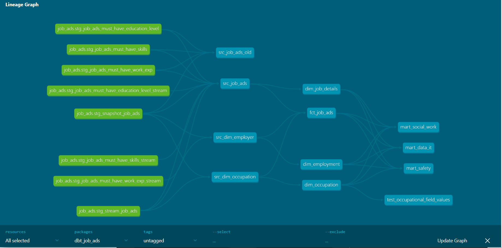

# HR Analytics

> A project from course Big Data & Cloud

This project focuses on a cloud deployment of a ETL pipeline to Azure using Terraform as infrastructure as code. The pipeline includes dlt script, dbt transformation presented in a Streamlit dashboard and orchestrated in Dagster.

### Steps for cloud deployment
1. Created a Azure storage account with Azure file share (see storage.tf)
2. Created a Azure Container Registry including our docker containers (see container_registry.tf)
3. Spun up container instances to run the Dagster script (in Azure CLI)
4. Created a Azure Web App to host the dashboard (see web_server.tf)
5. Added a Container Registry to the web app deployed from Docker
6. Added a path mapping to mount the file share to the web server

## Azure resources costs drivers
To keep this service always available to users and update the data warehouse once per day, the Azure resources mentioned below is needed. Read the table to better understand the cost drivers. Below the table, a pricing example is found.

| Azure Resource | Description | Primary Cost Model | Fixed Cost Components (Charged 24/7) | Running Cost Components |
| -------- | ------- | ------- | ------- | ------- |
| App Service Plan  | We have selected the lowest pricing tier in a Linux based plan, Basic B1. Each tier comes with a fixed amount of allocated vCPU, RAM, and Storage. We pay for this allocation 24/7, even if the web app is stopped or idle. We have not enabled scaling and only have one running instances. | Fixed (Reserved Compute) | Basic tier with 1 instance | |
| Container Registry | Stores, manages, and distributes container images (the static blueprint). Price per day based on service tier, which is the fixed base cost and includes a set amount of storage. | Fixed (Tier-Based) | Daily Fee for the selected tier (Basic in our case) which includes a base amount of storage. | Only if limits are exceeded |
| Storage Account | Azure File Shares. The storage account bills only for what we store, measured in GiB per month and what we do with it (transactions). Also depends on the redundancy of choice, copies and geographic spread. We have the cheapest LRS and no geographical spread, nor backups. Transactions (Operations) - The cost for every read, write, delete, or list operation (API call) you perform on the files in your share. As we are charged per a block of operations (e.g., per 10,000 transactions), we will not exceed to lowest limit. | Running (Consumption based) | | Storage Capacity (price per GiB per month) based on the redundancy option LRS and access tier Cool. Transactions (cost per 10,000 operations) |
| Container Instances (ACI) | We pay for the resources allocated to the container group for the duration it is running, billed down to the second. Primary pricing components is vCPU Duration: The amount of virtual CPU cores requested for the container group, charged per second and Memory (GiB) Duration: The amount of memory (in gigabytes) requested for the container group, charged per second. | Consumption (Serverless Compute) | | vCPU and Memory Duration (Charged per second from deployment until stop/ |deletion). 

## Cost estimation - cloud deployment
### Assumptions
* The duckdb data warehouse should be updated once per day
* The deployed dashboard should be always available to users

Focusing on Pay as you go pricing plan. Other billing models exist, like provisioned models. They operate on a provisioned basis where you pay for reserved storage, and throughput, regardless of actual usage. These other plans are not covered here.
### Pricing example
|Resource|Price|Cost per month|
| -------- | ------- | ------- |
|Container instance #1: Pipeline| Memory 4GB 1 container group 0.0000014 per GB/s 14.72$/month. Price per vCPU/s 0,0000129  (Usage 17% CPU/second)| 33,55$ 14.72$ |
|Container instance #2: Bulk | Memory 4GB 1 container group 0.0000014 per GB/s 14.72$/month. Price per vCPU/s 0,0000129 | 33,55$ (Only first month) 14.72$(Only first month) |
|Storage|Based on 1 GB Storage Used capacity  and data retrieval under 10,000 operations|$0.26|
|Web app|1 core, 1.75 GB RAM, 10 GB Storage US$0.018, 1 instances | US$13.14 |
|Container registry|Tier: Basic, 30 days × US$0.167 per registry per day|US$5.00|
|**Total monthly cost**||**$66,67/month $114,94 first month only**|

## If we go with Snowflake
Pricing in Snowflake has 3 main components; compute, storage and transfer. For a small dataset like this (ariund 80 MB of the Duckdb warehouse), the main costs will be Compute related used for dbt transformations and dashboard queries.

Calucaltion example:
Assumptions
* query run time: 3 minutes = 0.05h
* warehouse size: XS, 1 credit/hr
* Price for one credit (Azure - West Europe (Netherlands)): $2.60

Daily Cost: 0.05*1*2.60 = $1.3
Monthly cost: 0.05*1*2.60*30 = $39

Given our small data set, storage costs is expected to be less than $1 as Snoflake charges per Terabyte per month.

### Pros and cons with Snowflake
**Pros**
* Snowflake support is superior to Azures
* No lock in with one specific cloud provider
* Built in support for Streamlit
**Cons**
* Slightly more expensive
* Very scalable and harder to manage computation costs
* Not as broad product offering as Azure

## Data transformations
### Data linegae in dbt 

#### Data tests
**Generic data tests (dbt core)**
* All primary keys has unique tests. Checks for unique values in a column.
* All primary keys has not_null tests. Ensures no values in a column are null.
* Foreign key constraints is tested on all foreign keys. Referntial integrity ensured using relationship tests.

**dbt_expectations tests**
* expect_column_values_to_be_of_type, check specifc types of key columns

**Bespoke tests**
* See test_occupational_field_values.sql for accepted values test. Checks that all values in a occupational field contains the intended fields.